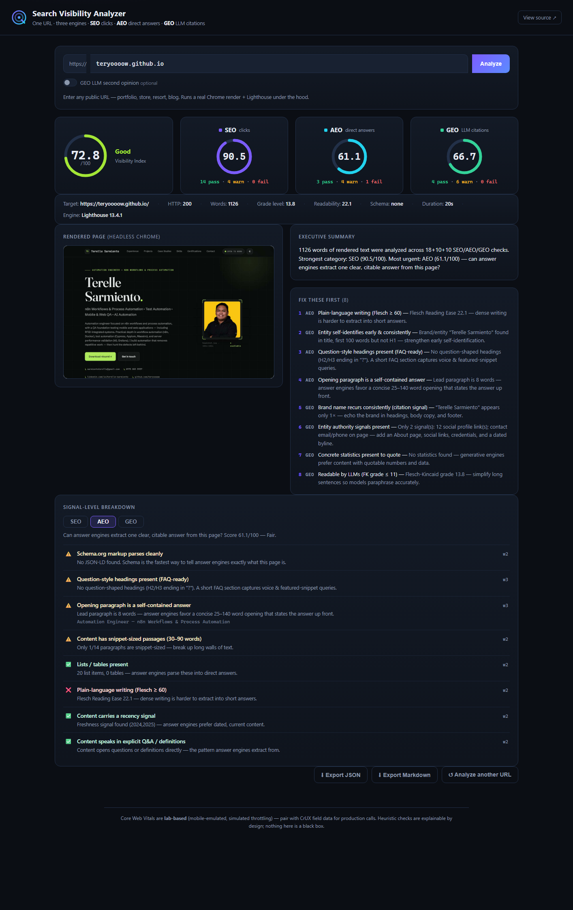

# Search Visibility Analyzer — SEO · AEO · GEO

> Analyze **any URL** for how it will perform across the three engines that now
> send traffic: **SEO** (traditional search → clicks), **AEO** (answer engines →
> direct answers / featured snippets / voice), and **GEO** (generative engines →
> citations from ChatGPT, Perplexity, Gemini, AI Overviews).

A working technical-challenge submission: a real Chrome render + Lighthouse
Core Web Vitals + 38 explainable signal checks, a polished web UI **and** a CLI,
a deterministic scoring core (no black boxes), and an optional LLM
"second opinion" that simulates how a generative engine would actually read and
cite the page.



---

## Quick start

### Option A — Docker (easiest for reviewers: nothing but Docker required)

```bash
docker build -t visibility-analyzer .
docker run -p 3100:3100 visibility-analyzer
# → open http://localhost:3100
```

No Node.js and no Chrome install needed on the host — the image bundles
headless Chromium. (Optional LLM layer:
`docker run -p 3100:3100 -e GEO_LLM_API_KEY=sk-... visibility-analyzer`.)

### Option B — Local (Node.js ≥ 18 + Chrome/Chromium)

Requires **Node.js ≥ 18** and **Chrome/Chromium** (Lighthouse runs the page in
headless Chrome; it auto-detects a normal install on Windows/macOS/Linux, or
point it at one via the `CHROME_PATH` env var).

```bash
npm install

# Web UI → http://localhost:3100
npm start

# or the CLI
node cli.js https://your-site.com
node cli.js https://your-site.com --json report.json --md report.md --shot screenshot.jpg
```

### Option C — no install at all

Watch the demo: the screenshots in this README, the sample reports under
[`docs/demo/`](docs/demo/) (JSON + Markdown), and the 2-page walkthrough PDF
that accompanies this submission. A live walkthrough call can be arranged.

---

Open the UI, paste a URL, hit **Analyze**. First run takes ~30–90 s (Chrome
launch + Lighthouse); the page shows live progress and renders a full report:
overall **Visibility Index**, per-category scores (SEO/AEO/GEO), a screenshot of
the rendered page, an executive summary, a prioritized fix list, and a
signal-by-signal breakdown with evidence — exportable as JSON or Markdown.

### Optional: GEO "LLM second opinion"

The core analysis is fully deterministic and needs **no API keys**. To enrich
the GEO section with an actual LLM reading of the page, point the tool at any
OpenAI-compatible endpoint (OpenAI, DeepSeek, Groq, OpenRouter, or a local
Ollama) via environment variables — see [`.env.example`](.env.example):

```bash
export GEO_LLM_API_KEY=sk-...
export GEO_LLM_BASE_URL=https://api.openai.com/v1   # provider-specific
node cli.js https://your-site.com --llm
# or tick "GEO LLM second opinion" in the UI
```

---

## What it measures

| Category | Question it answers | Representative checks |
| --- | --- | --- |
| **SEO** — clicks | Will Google/Bing find, index, and get clicks? | HTTP status, title/meta length, indexability (noindex), robots.txt + sitemap, canonical, H1 & heading hierarchy, HTTPS, viewport, **Core Web Vitals** (LCP/CLS/TBT from Lighthouse), Lighthouse performance score, content depth, image alt text, semantic HTML, internal links |
| **AEO** — direct answers | Can Siri / voice / featured snippets extract one clean answer? | JSON-LD validity, high-value schema types (FAQPage/HowTo/Article/…), required-field completeness per type, question-shaped headings, definitional lead paragraph, snippet-sized passages (30–90 words), lists/tables, plain-language Flesch score, recency signals, explicit Q&A phrasing |
| **GEO** — LLM citations | Would ChatGPT/Perplexity confidently identify, trust, and quote it? | Entity self-identification (title/H1/first 100 words), brand recurrence & footer consistency, authority signals (About, socials, credentials, bylines), **statistics density**, quotability (quotes + short sentences), sourced/attributed claims, FK-grade readability, freshness, boilerplate detection, entity schema grounding |

Every check is explainable: status (`pass` / `warn` / `fail`), a human-readable
reason, and where useful the raw evidence. Scores are weighted (1–4 per check,
warn = half credit), rolled into a 0–100 category score, and the three
categories average into the overall **Visibility Index**. See
[`src/analyzers/`](src/analyzers) and the scoring rules in
[`src/score.js`](src/score.js).

**Design principle:** nothing here is a black box. Where a judgment call is
heuristic (e.g. "is this paragraph snippet-sized?"), the rule is written in the
check's detail text so a consultant can defend every point to a client.

---

## Architecture

```
                     ┌────────────────────────────────────────────┐
                     │  cli.js  ·  server.js (Express + job queue)│
                     └──────────────┬─────────────────────────────┘
                                    │
                        src/analyze.js  (pipeline)
                                    │
   ┌───────────────┬────────────────┼────────────────┬──────────────────┐
   │               │                │                │                  │
capture.js     lighthouse.js   robots.js        extract.js        geo-llm.js (opt.)
real Chrome     CWV + perf     robots.txt +     cheerio parser    LLM simulates a
render via CDP   scores         sitemap probe    → page model     generative read
   │               │                │                │                  │
   └───────────────┴────────────────┼────────────────┘                  │
                                    ▼                                   │
                      analyzers/seo.js · aeo.js · geo.js                │
                      (deterministic checks → score.js weights)         │
                                    │                                   │
                                    ▼                                   ▼
                         report.js  →  JSON · Markdown · Web dashboard
```

- **One headless Chrome** serves both consumers: a CDP session captures the
  fully rendered DOM (client-side JS included) + a JPEG screenshot, then
  Lighthouse attaches to the same debugging port for lab Core Web Vitals.
- **Extraction** (`extract.js`) turns rendered HTML into a normalized page
  model; analyzers are pure functions over that model — easy to unit test
  (see `test/`, 21 tests, fixtures included).
- **Errors degrade gracefully**: non-HTML responses, timeouts, unreachable
  hosts, and even "404 with content" servers (some CDNs do this) produce clear
  messages or scored checks instead of crashes.

```
npm test        # vitest — extraction + analyzer behavior on good/poor fixtures
```

---

## Live demo reports (this repo's own pages — dogfooding)

| Target | Visibility Index | SEO | AEO | GEO | Notes |
| --- | --- | --- | --- | --- | --- |
| [teryoooow.github.io](https://teryoooow.github.io) (portfolio) | 72.9 | 91.0 | 61.1 | 66.7 | Strong meta & structure; content is resume-style, so AEO/GEO suffer (no FAQ, few stats) |
| [teryoooow.github.io/edens-private-pool](https://teryoooow.github.io/edens-private-pool/) (resort) | 74.1 | 71.8 | 78.3 | 72.2 | LocalBusiness schema detected; plain-language copy scores well for AEO |
| [backlinko.com/hub/seo](https://backlinko.com/hub/seo/) | 65.7 | 79.5 | 69.6 | 48.1 | Rich schema (Organization/BreadcrumbList); thin hub-page copy caps GEO |

Full JSON + Markdown reports: [`docs/demo/`](docs/demo/). These reports double
as regression samples — re-run any of them after a code change and diff.

---

## Repository layout

```
Dockerfile  .dockerignore
cli.js  server.js  package.json
src/
  analyze.js        pipeline orchestrator (progress callbacks)
  capture.js        CDP render + screenshot; shared Chrome lifecycle
  chrome.js         chrome-launcher + minimal CDP client
  lighthouse.js     Core Web Vitals + perf/SEO scores
  extract.js        rendered HTML → normalized page model
  robots.js         robots.txt / sitemap.xml probe
  analyzers/        seo.js · aeo.js · geo.js  (pure check logic)
  score.js          weighted scoring + grades
  report.js         Markdown/JSON serializers
  llm.js            OpenAI-compatible chat client (no SDK)
  geo-llm.js        structured "would I cite this?" LLM prompt
public/             single-page dashboard (no frameworks, no CDN)
test/               vitest suite + good/poor HTML fixtures
docs/
  demo/             sample reports + UI screenshot
  PROCESS.md        tool selection, data extraction, prompts, architecture notes
  BUSINESS_VALUE.md client value justification
  ROADMAP.md        5 prioritized future upgrades
scripts/            demo helpers (ui-shot.js)
```

---

## Documentation deliverables

This challenge required four artifacts — all in this repo:

1. **Functional application** — this repository + UI/CLI (see Quick start & demo reports).
2. **Process documentation** — [`docs/PROCESS.md`](docs/PROCESS.md) (tooling rationale, extraction techniques, prompt engineering, architecture).
3. **Business value justification** — [`docs/BUSINESS_VALUE.md`](docs/BUSINESS_VALUE.md).
4. **Product roadmap** — [`docs/ROADMAP.md`](docs/ROADMAP.md) (five prioritized upgrades).

## Troubleshooting for evaluators

- **"Could not find Chrome"** → install Chrome/Chromium, or set `CHROME_PATH` to
  your binary (Windows: `C:\Program Files\Google\Chrome\Application\chrome.exe`).
- **Analysis fails instantly with a timeout/network error** → the target site may
  block datacenter IPs (Docker) or your network egress; try another public URL
  or run locally.
- **Headless Linux (no Docker)** → install `chromium` + its dependencies, set
  `CHROME_PATH`; the launcher already passes `--no-sandbox` where needed.
- **Everything else** → the app never crashes silently: every failure path
  returns a plain-English error in the UI/CLI. File an issue on the repo.

## Honest limitations

- **Core Web Vitals are lab-based** (mobile emulation + simulated throttling on
  this machine). They reliably catch gross problems but are not a substitute
  for CrUX field data — the report says so in the footer.
- Checks are **heuristic by design** so they stay explainable; an LLM never
  decides a score. The optional LLM layer only adds a second opinion.
- Single-page analysis today; whole-site crawls are roadmap item #3.
- Respects no login-gated content (it analyzes what a public crawler sees).

---

Built with Node.js, Lighthouse, cheerio, Express, and a lot of free tiers —
no commercial API required for the core. MIT licensed.
